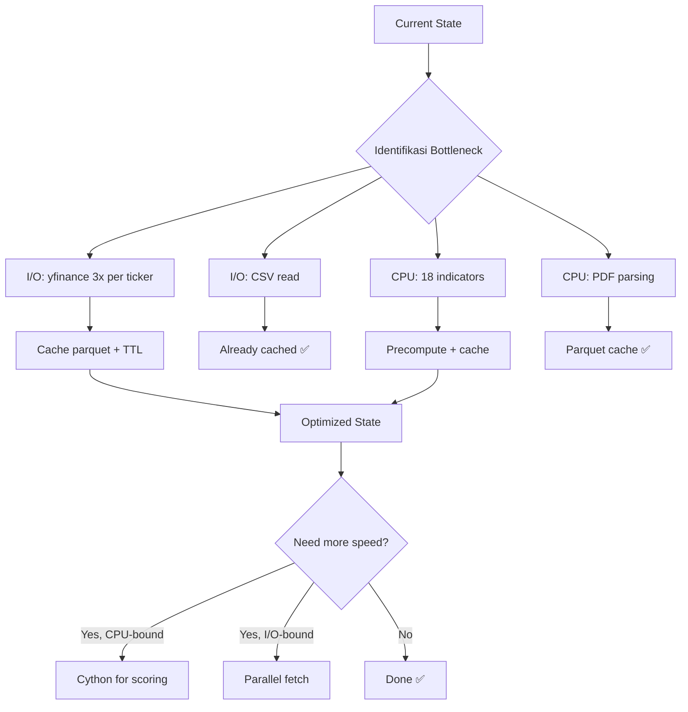

# Evaluasi & Optimasi Proyek Screener

## Ringkasan Arsitektur Saat Ini

```
screener.py (main engine, 170+ ticker, 18 indikator)
    ↓ CSV output (screener_ihsg_*.csv)
    ↓
telegram_bot.py (bot Telegram, 20+ command)
    ├── data_fetcher.py (yfinance)
    ├── indicators.py (pandas)
    ├── scoring_engine.py (scoring v11)
    ├── nlp_scraper.py (VADER sentiment)
    ├── shareholder_analyzer.py (KSEI data)
    └── dashboard/alerts.py (Discord + Telegram)

scalp/ (scalping intraday)
    ├── producer.py (1m OHLCV → SQLite)
    ├── signals.py (15 real features)
    ├── ai.py (ensemble inference)
    └── executor.py (paper trading)
```

---

## 1. Analisis Bottleneck

### 1.1 Screener Engine (`screener.py`)
- **170+ ticker** × **18 indikator** = ~3060 kalkulasi per run
- Menggunakan **pandas** (vectorized) — sudah cukup optimal
- **Waktu:** ~5-10 menit per run (tergantung rate limit Yahoo Finance)

### 1.2 Telegram Bot (`telegram_bot.py`)
- **`_lookup_ticker_live()`** — fetch 6 bulan data + 18 indikator + scoring v11
- **Waktu:** ~3-5 detik per ticker (tergantung yfinance)
- **Masalah:** Setiap `/cek` memanggil yfinance **3 kali** (daily, weekly, monthly)

### 1.3 Shareholder Analyzer
- Parse PDF KSEI — **sangat lambat** (3-5 menit untuk 25 PDF)
- Cache parquet membantu, tapi rebuild cache lambat

---

## 2. Rekomendasi Optimasi

### 2.1 Optimasi Tanpa Cython (High Impact, Low Effort)

| Optimasi | Dampak | Effort | File |
|----------|--------|--------|------|
| **Cache yfinance data** — Simpan OHLCV harian ke parquet, hindari re-fetch | ⚡ Sangat Tinggi | Rendah | `data_fetcher.py` |
| **Parallel fetch** — Gunakan `concurrent.futures` untuk fetch multiple ticker | ⚡ Tinggi | Rendah | `telegram_bot.py` |
| **Precompute indicators** — Simpan indikator ke cache, bukan hitung ulang | ⚡ Tinggi | Rendah | `indicators.py` |
| **Lazy import** — Import module hanya saat diperlukan (sudah sebagian) | 🟡 Sedang | Rendah | Semua file |
| **SQLite optimization** — Gunakan WAL mode + index | 🟡 Sedang | Rendah | `telegram_bot.py` |
| **Batch CSV reading** — Baca CSV sekali, cache di memory (sudah) | ✅ Done | - | `telegram_bot.py` |

### 2.2 Optimasi dengan Cython (Medium Impact, Medium Effort)

| Optimasi | Dampak | Effort | File |
|----------|--------|--------|------|
| **Compile scoring engine** — Ubah `scoring_engine.py` ke `.pyx` | 🟡 Sedang | Sedang | `scoring_engine.py` |
| **Compile indicators** — Fungsi kritis (RSI, MACD, ADX) ke Cython | 🟡 Sedang | Sedang | `indicators.py` |
| **Compile shareholder parser** — Parse PDF lebih cepat | 🟡 Sedang | Tinggi | `shareholder_analyzer.py` |

**Catatan:** Cython hanya memberi percepatan 1.5x-3x untuk kode numerik. Karena sebagian besar waktu dihabiskan di **I/O (network)** dan **pandas (already C-optimized)**, Cython tidak akan memberi dampak signifikan.

### 2.3 Optimasi dengan Rust/Python Binding (High Impact, High Effort)

| Optimasi | Dampak | Effort |
|----------|--------|--------|
| **Rewrite scoring engine in Rust** (via PyO3) | ⚡ Tinggi | Sangat Tinggi |
| **Rewrite PDF parser in Rust** | ⚡ Tinggi | Sangat Tinggi |
| **Rewrite real-time scalping in Rust** | ⚡ Tinggi | Sangat Tinggi |

**Catatan:** Rust memberikan percepatan 10x-50x untuk kode komputasi berat, tapi effort development sangat tinggi.

---

## 3. Rekomendasi Prioritas (Tanpa Cython/Rust)

### Priority 1: Cache yfinance Data

**Masalah:** Setiap `/cek TICKER` memanggil yfinance 3 kali (daily, weekly, monthly).

**Solusi:** Simpan OHLCV ke parquet dengan TTL 1 jam.

```python
# data_fetcher.py — tambah cache
import pandas as pd
import os, time

_CACHE_DIR = "cache/yfinance"
_CACHE_TTL = 3600  # 1 jam

def fetch_price_data_cached(ticker, period="6mo", interval="1d"):
    cache_path = os.path.join(_CACHE_DIR, f"{ticker}_{period}_{interval}.parquet")
    if os.path.exists(cache_path):
        mtime = os.path.getmtime(cache_path)
        if time.time() - mtime < _CACHE_TTL:
            return pd.read_parquet(cache_path)
    df = fetch_price_data_sync(ticker, period, interval)  # original
    if df is not None:
        os.makedirs(_CACHE_DIR, exist_ok=True)
        df.to_parquet(cache_path)
    return df
```

**Dampak:** `/cek` dari 3-5 detik → 0.1 detik (jika data sudah di-cache).

### Priority 2: Parallel Fetch untuk Multiple Ticker

**Masalah:** `/swing`, `/scalp`, `/sinyal` membaca dari CSV (cepat), tapi tidak ada parallel processing.

**Solusi:** Gunakan `concurrent.futures.ThreadPoolExecutor` untuk fetch multiple ticker.

```python
from concurrent.futures import ThreadPoolExecutor, as_completed

def _lookup_ticker_live_batch(tickers: list[str]) -> list[dict]:
    with ThreadPoolExecutor(max_workers=4) as executor:
        futures = {executor.submit(_lookup_ticker_live, t): t for t in tickers}
        results = []
        for future in as_completed(futures):
            results.append(future.result())
    return results
```

### Priority 3: SQLite WAL Mode

**Masalah:** Portfolio tracker menggunakan SQLite tanpa optimasi.

**Solusi:** Aktifkan WAL mode dan index.

```python
# Di cmd_entry, main(), dll.
conn.execute("PRAGMA journal_mode=WAL")
conn.execute("PRAGMA synchronous=NORMAL")
conn.execute("CREATE INDEX IF NOT EXISTS idx_posisi_ticker ON posisi(ticker)")
```

### Priority 4: Precompute Indicators

**Masalah:** `_lookup_ticker_live()` menghitung 18 indikator setiap kali.

**Solusi:** Simpan hasil indikator ke cache.

```python
# indicators.py — tambah cache per ticker
_indicator_cache: dict[str, dict] = {}
_INDICATOR_CACHE_TTL = 300  # 5 menit

def get_cached_indicators(ticker: str) -> dict | None:
    cache = _indicator_cache.get(ticker)
    if cache and time.time() - cache["_ts"] < _INDICATOR_CACHE_TTL:
        return cache
    return None
```

---

## 4. Evaluasi Cython untuk Proyek Ini

### Apakah Cython diperlukan?

| Kriteria | Screener | Scalping |
|----------|----------|----------|
| **CPU-bound?** | 🟡 Sebagian (indikator) | 🟡 Sebagian (signal) |
| **I/O-bound?** | ⚠️ Ya (yfinance, CSV) | ⚠️ Ya (SQLite, API) |
| **Real-time?** | ❌ Tidak (harian) | ✅ Ya (1 menit) |
| **Loop besar?** | 🟡 170 ticker | 🟡 Banyak sinyal |

**Kesimpulan:** Cython **tidak kritis** untuk proyek ini. Bottleneck utama adalah **I/O (network, disk)**, bukan CPU.

### Kapan Cython berguna?

1. **Scoring engine** — Jika ada ribuan ticker real-time
2. **PDF parser** — Jika ada ratusan PDF KSEI
3. **Scalping signal** — Jika perlu latensi < 100ms

### Alternatif yang Lebih Praktis dari Cython

| Approach | Percepatan | Effort |
|----------|-----------|--------|
| **pandas vectorized** (already used) | 10-50x vs Python loop | ✅ Done |
| **numba** (JIT compile) | 10-100x | Rendah |
| **Cache yfinance data** | 10-50x | Rendah |
| **Parallel fetch** | 2-4x | Rendah |
| **Cython** | 1.5-3x | Sedang |
| **Rust (PyO3)** | 10-50x | Tinggi |

---

## 5. Rekomendasi Final

### Yang Harus Dilakukan (High Impact, Low Effort)

1. **Cache yfinance data** ke parquet — ⚡ percepatan 10-50x untuk `/cek`
2. **Parallel fetch** dengan ThreadPoolExecutor — ⚡ percepatan 2-4x untuk batch
3. **SQLite WAL mode** — 🟡 percepatan 2-3x untuk portfolio
4. **Precompute indicators** — 🟡 percepatan 2-5x untuk indikator berulang

### Yang Bisa Ditunda (Medium Impact, Medium Effort)

5. **Cython untuk scoring engine** — 🟡 percepatan 1.5-2x
6. **Cython untuk indicators** — 🟡 percepatan 1.5-2x

### Yang Tidak Perlu (Saat Ini)

7. **Rust rewrite** — Effort terlalu tinggi untuk benefit yang ada
8. **Cython untuk PDF parser** — PDF parsing sudah di-cache ke parquet

---

## 6. Diagram Alur Optimasi


