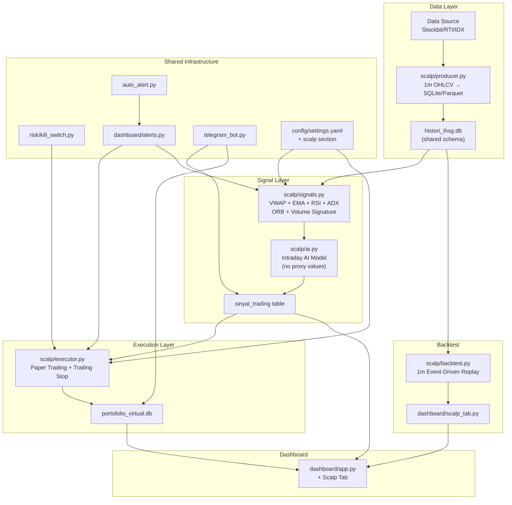
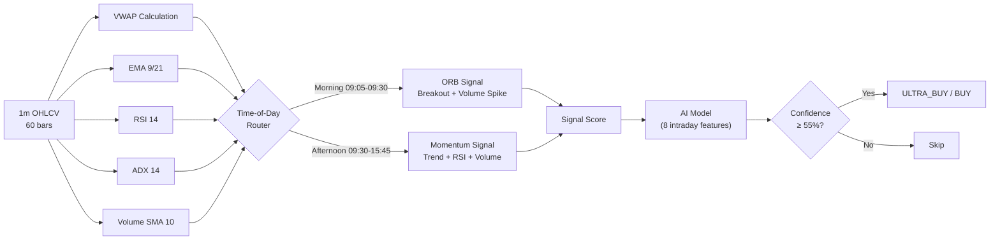
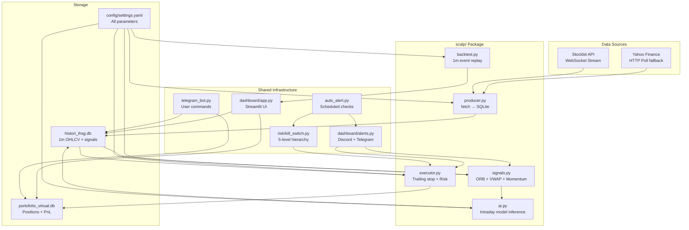

# Technical Specification: Scalping System Upgrade v2.0
## Sharing Infrastructure with Swing System

**Date:** 2026-05-15  
**Status:** DRAFT — Pending Review  
**Author:** Architect Mode  
**Target:** Migrate `1_producer_data.py`, `2_consumer_ai.py`, `3_consumer_r1.py` to modular `scalp/` package sharing infra with existing swing system

---

## Table of Contents

1. [Current State Audit](#1-current-state-audit)
2. [Identified Problems (with line numbers)](#2-identified-problems)
3. [Target Architecture](#3-target-architecture)
4. [Package Structure](#4-package-structure)
5. [DB Schema Unification](#5-db-schema-unification)
6. [Config Externalization](#6-config-externalization)
7. [Signal Pipeline Design](#7-signal-pipeline-design)
8. [Backtest Engine Design](#8-backtest-engine-design)
9. [Infrastructure Integration](#9-infrastructure-integration)
10. [Data Source Migration](#10-data-source-migration)
11. [Implementation Phases](#11-implementation-phases)
12. [File Mapping (Old → New)](#12-file-mapping-old--new)

---

## 1. Current State Audit

### 1.1 Scalping Files Analyzed

| File | Lines | Purpose | Key Issues |
|------|-------|---------|------------|
| [`1_producer_data.py`](1_producer_data.py:1) | 230 | Producer: 1m OHLCV fetch → SQLite | Duplicate DB schema, hardcoded Yahoo Finance URL, hardcoded ticker list, no config |
| [`2_consumer_ai.py`](2_consumer_ai.py:1) | 305 | Consumer AI: signal generation | 12 proxy values in AI feature vector, duplicate DB schema, hardcoded time filters, hardcoded TP/SL |
| [`3_consumer_r1.py`](3_consumer_r1.py:1) | 321 | Consumer RL: paper trading + execution | Hardcoded capital, hardcoded risk params, duplicate DB schema, own Discord code, no shared alerting |

### 1.2 Swing Infrastructure Already Exists

| Component | File(s) | What It Provides |
|-----------|---------|-----------------|
| Dashboard | [`dashboard/app.py`](dashboard/app.py:1) | Streamlit UI with 5 tabs (Account, Backtest, Drill-down, Walk-Forward, Alerts) |
| Alert Manager | [`dashboard/alerts.py`](dashboard/alerts.py:1) | Unified Discord + Telegram dispatcher with `AlertManager` class |
| Auto Alert Scheduler | [`auto_alert.py`](auto_alert.py:1) | APScheduler: drawdown checks every 5min, morning/closing reports |
| Telegram Bot | [`telegram_bot.py`](telegram_bot.py:1) | `/cek`, `/sinyal`, `/report`, `/portfolio`, `/status` commands |
| Kill Switch | [`risk/kill_switch.py`](risk/kill_switch.py:1) | 5-level risk hierarchy (trade → session → week → month → account floor) |
| Backtest Engine | [`backtest.py`](backtest.py:1) | Event-driven backtest, walk-forward optimization, tearsheet metrics |
| Config | [`config/settings.yaml`](config/settings.yaml:1) | Centralized YAML config (swing-focused, needs scalp section) |
| Security | [`security.py`](security.py:1) | `.env` loading, encryption, secure storage |

---

## 2. Identified Problems

### 2.1 Duplicate DB Schema (CRITICAL)

Three separate files each define their own `init_db()` / schema creation:

| File | Line(s) | Tables Created |
|------|---------|---------------|
| [`1_producer_data.py`](1_producer_data.py:69) | 69–92 | `histori_ihsg`, `log_error` |
| [`2_consumer_ai.py`](2_consumer_ai.py:41) | 41–56 | `sinyal_trading`, `consumer_state` |
| [`3_consumer_r1.py`](3_consumer_r1.py:101) | 101–118 | `akun`, `posisi`, `histori_trade` |

**Problem:** No foreign keys, no shared connection pool, schema changes require touching 3 files, risk of inconsistency.

### 2.2 Hardcoded Proxy Values (HIGH)

In [`2_consumer_ai.py`](2_consumer_ai.py:212) lines 212–228, the AI feature vector uses **12 hardcoded proxy values** commented as `# proxy`:

| Line | Feature | Hardcoded Value | What It Should Be |
|------|---------|-----------------|-------------------|
| 214 | Skor | `5.0` | Calculate from signal quality |
| 215 | Confidence% | `60.0` | Calculate from model output |
| 218 | Stoch | `50.0` | Calculate from Stochastic indicator |
| 219 | CCI | `0.0` | Calculate from CCI indicator |
| 220 | BB_Width% | `5.0` | Calculate from Bollinger Bands |
| 221 | RRR | `2.0` | Derive from entry/SL/TP |
| 222 | MM_Confidence | `60.0` | Not available intraday — should be N/A or 0 |
| 223 | MM_vs_Retail_Ratio | `50.0` | Not available intraday — should be N/A or 0 |
| 224 | IHSG_Change | `0.0` | Fetch IHSG index % change |
| 225 | USD_Change | `0.0` | Fetch USD/IDR % change |
| 226 | RSI_1d | `rsi_v` (same as 1m RSI) | Should use daily RSI, not 1m |
| 227 | MACD_1d | `0.0` | Should use daily MACD |

Also, lines 253–254 use hardcoded TP/SL ratios (`1.015` and `1 - 0.01`).

### 2.3 Hardcoded Time Filters

[`2_consumer_ai.py`](2_consumer_ai.py:58) lines 58–79 — `is_trading_allowed()`:

```python
# Hardcoded time bands:
if t < 9 * 60 + 5:          # 09:00-09:05 → Auction
if 11 * 60 + 30 <= t < 13 * 60:  # 11:30-13:00 → Lunch
if t >= 15 * 60 + 45:       # 15:45-16:00 → Pre-close
if t > 16 * 60:             # >16:00 → Closed
```

Should be in `config/settings.yaml` under a `scalp.trading_hours` section.

### 2.4 Hardcoded Capital & Risk Parameters

[`3_consumer_r1.py`](3_consumer_r1.py:38) lines 38–47:

```python
FEE_BELI = 0.0015          # Should come from config/settings.yaml execution section
FEE_JUAL = 0.0025          # Duplicate of config/settings.yaml
SLIPPAGE_BUFFER = 0.002    # Duplicate
MAX_DAILY_LOSS_PCT = 0.03  # Conflicts with swing's 0.05 in config
MAX_POSITIONS = 5          # Already in settings.yaml
BREAKEVEN_TRIGGER = 0.008  # Scalp-specific, should be in config
TRAILING_DISTANCE = 0.005  # Scalp-specific, should be in config
CAPITAL_INITIAL = 100_000_000.0  # Hardcoded, not from .env or config
```

### 2.5 No Integration with Swing Infrastructure

| Swing Feature | Scalping Status |
|---------------|-----------------|
| [`dashboard/app.py`](dashboard/app.py:1) | No scalp tab, no intraday charts, no real-time PnL for scalp positions |
| [`dashboard/alerts.py`](dashboard/alerts.py:1) | Not used by scalping — `3_consumer_r1.py` has its own Discord code (line 52–66) |
| [`auto_alert.py`](auto_alert.py:1) | No scalp-specific drawdown monitoring, no scalp signals in reports |
| [`telegram_bot.py`](telegram_bot.py:1) | No scalp-specific commands (`/scalp_positions`, `/scalp_signals`) |
| [`risk/kill_switch.py`](risk/kill_switch.py:1) | Imported but the daily loss % check in `3_consumer_r1.py:89` uses `CAPITAL_INITIAL` instead of actual equity — **BUG** |
| [`backtest.py`](backtest.py:1) | End-of-day daily data only; no intraday 1m event-driven backtest |

### 2.6 No Intraday Backtest Engine

The existing [`backtest.py`](backtest.py:1) operates on daily screener CSV data. Scalping needs:
- 1-minute bar replay with OHLCV
- Multi-leg exit models (breakeven + trailing stop)
- Time-of-day partitioned performance metrics (morning breakout vs afternoon momentum)
- Per-session Sharpe, win rate by time band

### 2.7 Yahoo Finance 1m Data Unreliability

[`1_producer_data.py`](1_producer_data.py:106) line 106 constructs URL `https://query1.finance.yahoo.com/v8/finance/chart/{ticker_clean}.JK?interval=1m&range=1d`:
- Yahoo Finance free tier rate-limits aggressively (429 errors tracked at line 113–115)
- 1m data for Indonesian stocks is sparse — many tickers return empty results (lines 123–125)
- No WebSocket streaming — 30s polling cycle misses tick-level data
- 170 tickers × 30s cycle = heavy bandwidth, high fail rate

---

## 3. Target Architecture



### Design Principles

1. **Schema Once, Import Everywhere:** Single `src/data/schema.py` defines all tables; producer/consumer/executor import it
2. **Config-Driven:** Zero magic numbers — all parameters from `config/settings.yaml`
3. **Shared Alerting:** Scalping uses `dashboard/alerts.py` AlertManager, never its own Discord code
4. **Shared Kill Switch:** Single `risk/kill_switch.py` instance shared across swing and scalp
5. **Pluggable Data Source:** Abstract `DataSource` base class; Yahoo Finance → Stockbit/RTI as primary
6. **Real AI Features, Not Proxies:** Scalp-specific feature vector computed from actual intraday data

---

## 4. Package Structure

### 4.1 New Directory Layout

```
c:/Screener/
├── config/
│   └── settings.yaml                 # ADD: scalp section
├── src/
│   ├── data/
│   │   ├── __init__.py
│   │   ├── schema.py                 # NEW: single DB schema definition
│   │   └── fetcher.py               # NEW: abstract DataSource + YH/YF/Stockbit impl
│   ├── signals/
│   │   ├── __init__.py
│   │   ├── swing_strategy.py        # EXISTING
│   │   ├── scoring.py               # EXISTING
│   │   └── ai_coordinator.py        # EXISTING
│   ├── execution/
│   │   ├── __init__.py
│   │   ├── sizer.py                 # EXISTING (use for scalp too)
│   │   └── slippage.py              # EXISTING (use for scalp too)
│   └── backtest/
│       ├── __init__.py
│       └── engine.py                # REFACTOR: extract from backtest.py
├── scalp/
│   ├── __init__.py
│   ├── config.py                    # NEW: load scalp section from settings.yaml
│   ├── producer.py                  # PORT from 1_producer_data.py
│   ├── signals.py                   # PORT from 2_consumer_ai.py (signal logic only)
│   ├── ai.py                        # NEW: scalp-specific AI (no proxies)
│   ├── executor.py                  # PORT from 3_consumer_r1.py
│   ├── backtest.py                  # NEW: intraday event-driven backtest
│   └── run.py                       # NEW: CLI entry point (python -m scalp.run)
├── risk/
│   ├── __init__.py
│   ├── kill_switch.py               # EXISTING (shared)
│   └── correlation.py               # EXISTING (shared)
├── dashboard/
│   ├── app.py                       # MODIFY: add scalp tab
│   ├── alerts.py                    # EXISTING (shared)
│   └── scalp_tab.py                 # NEW: scalp-specific dashboard tab
├── auto_alert.py                     # MODIFY: add scalp signal monitoring
├── telegram_bot.py                   # MODIFY: add scalp commands
├── backtest.py                       # REFACTOR: core engine → src/backtest/engine.py
└── 1_producer_data.py                # DEPRECATE → delete after migration
└── 2_consumer_ai.py                  # DEPRECATE → delete after migration
└── 3_consumer_r1.py                  # DEPRECATE → delete after migration
```

### 4.2 Module Responsibilities

| New Module | Old File | Responsibility |
|------------|----------|----------------|
| [`scalp/config.py`](scalp/config.py) | (new) | Load `scalp` section from YAML, provide typed config object |
| [`scalp/producer.py`](scalp/producer.py) | [`1_producer_data.py`](1_producer_data.py:1) | Fetch 1m data, write to SQLite via `src/data/schema.py` |
| [`scalp/signals.py`](scalp/signals.py) | [`2_consumer_ai.py`](2_consumer_ai.py:96) (signal logic) | VWAP, EMA, RSI, ADX, ORB, volume signature calculation |
| [`scalp/ai.py`](scalp/ai.py) | (new, replaces proxy AI) | Intraday feature vector builder + model inference |
| [`scalp/executor.py`](scalp/executor.py) | [`3_consumer_r1.py`](3_consumer_r1.py:1) | Position management, trailing stop, risk checks, shared alerting |
| [`scalp/backtest.py`](scalp/backtest.py) | (new) | 1m event-driven replay, time-band metrics |
| [`src/data/schema.py`](src/data/schema.py) | (new, unifies 3 files) | All CREATE TABLE statements + migration helpers |
| [`src/data/fetcher.py`](src/data/fetcher.py) | (new) | Abstract DataSource, Yahoo Finance impl, Stockbit/RTI impl |

---

## 5. DB Schema Unification

### 5.1 Single Schema Module

File: [`src/data/schema.py`](src/data/schema.py)

```python
# All CREATE TABLE statements in ONE place.
# Producer, Consumer AI, and Executor import this module.

SCALP_TABLES = {
    "histori_ihsg": """
        CREATE TABLE IF NOT EXISTS histori_ihsg (
            id      INTEGER PRIMARY KEY AUTOINCREMENT,
            ticker  TEXT    NOT NULL,
            open    REAL,
            high    REAL,
            low     REAL,
            harga   REAL    NOT NULL CHECK(harga > 0),
            volume  REAL,
            waktu   DATETIME DEFAULT CURRENT_TIMESTAMP
        )
    """,
    "sinyal_trading": """
        CREATE TABLE IF NOT EXISTS sinyal_trading (
            id      INTEGER PRIMARY KEY AUTOINCREMENT,
            ticker  TEXT    NOT NULL,
            harga   REAL,
            sinyal  TEXT,
            tp      REAL,
            sl      REAL,
            confidence REAL,
            waktu   DATETIME DEFAULT CURRENT_TIMESTAMP
        )
    """,
    "log_error": """
        CREATE TABLE IF NOT EXISTS log_error (
            id      INTEGER PRIMARY KEY AUTOINCREMENT,
            ticker  TEXT,
            pesan   TEXT,
            waktu   DATETIME DEFAULT CURRENT_TIMESTAMP
        )
    """,
}

PORTFOLIO_TABLES = {
    "akun": """
        CREATE TABLE IF NOT EXISTS akun (
            saldo_cash REAL
        )
    """,
    "posisi": """
        CREATE TABLE IF NOT EXISTS posisi (
            rowid       INTEGER PRIMARY KEY AUTOINCREMENT,
            ticker      TEXT,
            harga_beli  REAL,
            sl          REAL,
            tp          REAL,
            shares      INTEGER,
            tanggal     TEXT,
            highest_price REAL DEFAULT 0,
            strategy    TEXT DEFAULT 'scalp'
        )
    """,
    "histori_trade": """
        CREATE TABLE IF NOT EXISTS histori_trade (
            ticker   TEXT,
            pnl      REAL,
            status   TEXT,
            tanggal  TEXT,
            strategy TEXT DEFAULT 'scalp'
        )
    """,
    "state": """
        CREATE TABLE IF NOT EXISTS state (
            key   TEXT PRIMARY KEY,
            value TEXT
        )
    """,
}

INDICES = [
    "CREATE INDEX IF NOT EXISTS idx_histori_ticker ON histori_ihsg(ticker)",
    "CREATE INDEX IF NOT EXISTS idx_histori_waktu  ON histori_ihsg(waktu)",
    "CREATE INDEX IF NOT EXISTS idx_sinyal_ticker  ON sinyal_trading(ticker)",
    "CREATE INDEX IF NOT EXISTS idx_sinyal_waktu   ON sinyal_trading(waktu)",
]

def init_histori_db(conn) -> None:
    """Initialize the market data database."""
    cur = conn.cursor()
    cur.execute("PRAGMA journal_mode=WAL")
    for ddl in SCALP_TABLES.values():
        cur.execute(ddl)
    for idx in INDICES:
        cur.execute(idx)
    conn.commit()

def init_portfolio_db(conn, initial_capital: float) -> None:
    """Initialize the portfolio database."""
    cur = conn.cursor()
    for ddl in PORTFOLIO_TABLES.values():
        cur.execute(ddl)
    cur.execute("SELECT saldo_cash FROM akun")
    if not cur.fetchone():
        cur.execute("INSERT INTO akun (saldo_cash) VALUES (?)", (initial_capital,))
    conn.commit()
```

### 5.2 Database Files

| Database | Purpose | Shared By |
|----------|---------|-----------|
| [`histori_ihsg.db`](histori_ihsg.db) | 1m OHLCV + signals | Producer → Consumer AI → Executor → Backtest |
| [`portofolio_virtual.db`](portofolio_virtual.db) | Positions, trade history, cash, state | Executor + Swing system |

The `strategy` column in `posisi` and `histori_trade` tables allows both swing and scalp trades to coexist in the same portfolio database, enabling unified PnL tracking in the dashboard.

---

## 6. Config Externalization

### 6.1 Add `scalp` Section to [`config/settings.yaml`](config/settings.yaml:1)

```yaml
# ── Scalping Strategy ──────────────────────────────────────────────────
scalp:
  enabled: true

  data_source:
    primary: yfinance           # yfinance | stockbit | rti | idx_api
    interval: 1m
    range: 1d
    cycle_interval_secs: 30
    max_concurrent: 5
    timeout_secs: 5
    max_retries: 2
    retry_delay_secs: 1.0
    skip_after_failures: 3

  trading_hours:                # WIB (UTC+7)
    session_start: "09:00"
    auction_end: "09:05"
    morning_session_start: "09:05"
    morning_session_end: "11:30"
    lunch_start: "11:30"
    lunch_end: "13:00"
    afternoon_session_start: "13:00"
    pre_close_start: "15:45"
    session_end: "16:00"

  time_filters:
    skip_auction: true          # 09:00-09:05
    skip_lunch: true            # 11:30-13:00
    skip_pre_close: true        # 15:45-16:00
    morning_breakout_window:    # 09:05-09:30
      start: "09:05"
      end: "09:30"

  indicators:
    ema_fast: 9
    ema_slow: 21
    rsi_period: 14
    adx_period: 14
    adx_threshold: 25
    vwap_period: 60             # bars for VWAP
    volume_sma_period: 10

  signals:
    morning_breakout:
      min_bars: 10
      vol_spike_mult: 2.5
      require_above_vwap: true
      require_above_open: true

    afternoon_momentum:
      min_bars: 30
      rsi_min: 40
      rsi_max: 70
      vol_spike_mult: 2.0
      require_above_ema: true
      require_above_vwap: true
      require_adx_above: 20

    liquidity:
      min_transaction_value: 50_000_000  # Rp 50M
      min_volume: 1000

  ai:
    model_path: ensemble_model.pkl
    confidence_threshold: 55.0
    features:                    # Intraday-specific features (no proxies)
      - rsi_1m
      - adx_1m
      - vwap_distance_pct
      - volume_ratio
      - ema_distance_pct
      - spread_pct
      - orb_position_pct
      - cumulative_delta

  execution:
    tp_pct: 0.015              # 1.5% take profit
    sl_pct: 0.01               # 1.0% stop loss
    spread_buffer_min_pct: 0.002  # 0.2% minimum spread buffer
    breakeven_trigger_pct: 0.008 # 0.8% profit → SL to breakeven
    trailing_distance_pct: 0.005 # Trail 0.5% below highest price
    trailing_activation_pct: 0.015  # After 1.5% profit
    max_daily_loss_pct: 0.03    # 3% daily loss → halt (scalp is tighter than swing's 5%)
    max_positions: 5
    cooldown_minutes: 5
    poll_fast_secs: 1.0
    poll_idle_secs: 3.0
    position_size_pct: 0.10     # 10% of equity per position

  backtest:
    engine: event_driven_1m
    time_bands:
      - name: morning_breakout
        start: "09:05"
        end: "09:30"
      - name: afternoon_momentum
        start: "09:30"
        end: "15:45"
    required_metrics:
      - total_trades
      - win_rate_pct
      - profit_factor
      - sharpe_ratio
      - sortino_ratio
      - max_drawdown_pct
      - expectancy_r
      - win_rate_by_band
      - avg_holding_minutes
```

### 6.2 Config Loader

File: [`scalp/config.py`](scalp/config.py)

```python
"""Load scalp configuration from config/settings.yaml with typed defaults."""
import os
import yaml
from dataclasses import dataclass, field

@dataclass
class ScalpConfig:
    # Data
    data_source: str = "yfinance"
    cycle_interval_secs: int = 30
    max_concurrent: int = 5
    timeout_secs: int = 5
    
    # Trading hours
    morning_breakout_start: str = "09:05"
    morning_breakout_end: str = "09:30"
    lunch_start: str = "11:30"
    lunch_end: str = "13:00"
    pre_close_start: str = "15:45"
    session_end: str = "16:00"
    
    # Signals
    ema_fast: int = 9
    rsi_period: int = 14
    adx_period: int = 14
    vol_spike_mult_morning: float = 2.5
    vol_spike_mult_afternoon: float = 2.0
    
    # AI
    ai_confidence_threshold: float = 55.0
    
    # Execution
    tp_pct: float = 0.015
    sl_pct: float = 0.01
    breakeven_trigger_pct: float = 0.008
    trailing_distance_pct: float = 0.005
    max_daily_loss_pct: float = 0.03
    max_positions: int = 5

    @classmethod
    def from_yaml(cls) -> "ScalpConfig":
        cfg_path = os.path.join(
            os.path.dirname(__file__), "..", "config", "settings.yaml"
        )
        with open(cfg_path) as f:
            data = yaml.safe_load(f) or {}
        scalp = data.get("scalp", {})
        return cls(
            data_source=scalp.get("data_source", "yfinance"),
            cycle_interval_secs=scalp.get("cycle_interval_secs", 30),
            max_concurrent=scalp.get("max_concurrent", 5),
            timeout_secs=scalp.get("timeout_secs", 5),
            morning_breakout_start=scalp.get("trading_hours", {}).get("morning_breakout_window", {}).get("start", "09:05"),
            morning_breakout_end=scalp.get("trading_hours", {}).get("morning_breakout_window", {}).get("end", "09:30"),
            tp_pct=scalp.get("execution", {}).get("tp_pct", 0.015),
            sl_pct=scalp.get("execution", {}).get("sl_pct", 0.01),
            max_daily_loss_pct=scalp.get("execution", {}).get("max_daily_loss_pct", 0.03),
            max_positions=scalp.get("execution", {}).get("max_positions", 5),
        )
```

---

## 7. Signal Pipeline Design

### 7.1 Signal Flow



### 7.2 Signal Functions (in [`scalp/signals.py`](scalp/signals.py))

```python
def compute_intraday_features(df: pd.DataFrame, config: ScalpConfig) -> dict:
    """
    Compute ALL features from actual 1m data — NO proxy values.
    
    Returns dict with:
      - vwap: float
      - ema9: float
      - rsi: float  
      - adx: float
      - vol_sma10: float
      - vol_ratio: float (current vol / avg vol)
      - vwap_distance_pct: float
      - ema_distance_pct: float
      - spread_pct: float (avg high-low / close)
      - orb_position_pct: float (distance from opening range)
      - candle_pattern: str (bullish/bearish/doji)
    """
    ...

def detect_morning_breakout(df: pd.DataFrame, config: ScalpConfig) -> SignalResult:
    """Opening Range Breakout (ORB) strategy for 09:05-09:30."""
    ...

def detect_afternoon_momentum(df: pd.DataFrame, config: ScalpConfig) -> SignalResult:
    """VWAP + EMA + RSI + Volume momentum for 09:30-15:45."""
    ...

def build_ai_feature_vector(features: dict, market_context: dict) -> list[float]:
    """
    Build 8-feature vector for AI model:
    1. rsi_1m
    2. adx_1m  
    3. vwap_distance_pct
    4. volume_ratio
    5. ema_distance_pct
    6. spread_pct
    7. orb_position_pct
    8. cumulative_delta (estimate from consecutive candle direction)
    """
    ...
```

### 7.3 Proxies Removed

| Old Proxy (line) | New Calculation |
|------------------|-----------------|
| `5.0` Skor | Compute from signal quality: `(rsi_score + trend_score + vol_score) / 3 * 15` |
| `60.0` Confidence% | Actual model `predict_proba` output |
| `50.0` Stoch | `StochasticOscillator(close, high, low, 14).stoch().iloc[-1]` |
| `0.0` CCI | `CCIIndicator(close, high, low, 20).cci().iloc[-1]` |
| `5.0` BB_Width% | `(bb_upper - bb_lower) / bb_middle * 100` from Bollinger |
| `2.0` RRR | `(tp_distance / sl_distance)` from actual entry |
| `60.0` MM_Confidence | `0.0` (not available intraday — mark as N/A) |
| `50.0` MM_vs_Retail_Ratio | `0.0` (not available intraday) |
| `0.0` IHSG_Change | Fetch `^JKSE` % change from data source |
| `0.0` USD_Change | Fetch `IDR=X` from data source |
| `rsi_v` RSI_1d | Use daily RSI from parquet/cache, not 1m RSI |
| `0.0` MACD_1d | Use daily MACD from parquet/cache |

---

## 8. Backtest Engine Design

### 8.1 Architecture

File: [`scalp/backtest.py`](scalp/backtest.py)

```python
class IntradayBacktest:
    """
    Event-driven replay of 1-minute bars.
    
    Key differences from swing backtest:
    - 1m bar resolution instead of daily
    - Multi-leg exit model (breakeven stop → trailing stop)
    - Time-of-day aware (separate metrics per session band)
    - Position sizing with transaction costs per leg
    """
    
    def __init__(self, config: ScalpConfig):
        self.config = config
        self.trades: list[TradeRecord] = []
    
    def run(
        self,
        data: pd.DataFrame,           # 1m OHLCV with ticker, datetime index
        start_date: str = None,
        end_date: str = None,
    ) -> BacktestResult:
        """Replay historical 1m data and simulate scalp strategy."""
        ...
    
    def _simulate_exit(
        self, 
        entry_price: float,
        stop_loss: float, 
        take_profit: float,
        price_series: pd.Series,
        high_series: pd.Series,
        low_series: pd.Series,
    ) -> ExitResult:
        """
        Realistic exit simulation using actual OHLC bars:
        - Check if SL hit intra-bar (low <= SL)
        - Check if TP hit intra-bar (high >= TP)
        - Apply breakeven stop after 0.8% profit
        - Apply trailing stop after 1.5% profit
        - Return exit price and reason
        """
        ...
    
    def metrics_by_time_band(self) -> dict:
        """Separate metrics for morning breakout vs afternoon momentum."""
        ...
```

### 8.2 Backtest Result Schema

```python
@dataclass
class BacktestResult:
    total_trades: int
    win_rate_pct: float
    profit_factor: float
    sharpe_ratio: float
    sortino_ratio: float
    max_drawdown_pct: float
    expectancy_r: float
    avg_holding_minutes: float
    avg_win_pct: float
    avg_loss_pct: float
    morning_win_rate: float     # 09:05-09:30
    afternoon_win_rate: float   # 09:30-15:45
    equity_curve: list[float]
    drawdown_curve: list[float]
    trade_log: list[TradeRecord]
```

---

## 9. Infrastructure Integration

### 9.1 Dashboard Integration

Add 6th tab to [`dashboard/app.py`](dashboard/app.py:274) — **"⚡ Scalping"**:

```python
tab_scalp = st.tabs([
    "💰 Account & Positions",
    "📈 Backtest Tearsheet", 
    "🔍 Stock Drill-Down",
    "🧪 Walk-Forward + AI",
    "📡 Alerts & Notifications",
    "⚡ Scalping",              # NEW
])
```

New [`dashboard/scalp_tab.py`](dashboard/scalp_tab.py) renders:

| Widget | Data Source | Refresh |
|--------|------------|---------|
| **Real-time Signal Feed** | `sinyal_trading` table filtered by `waktu >= now - 5min` | 5s |
| **Open Scalp Positions** | `posisi` WHERE `strategy = 'scalp'` | 5s |
| **Today's Scalp PnL** | PnL aggregation from `histori_trade` WHERE `strategy = 'scalp'` AND `tanggal = today` | 10s |
| **Volume-at-Price Chart** | `histori_ihsg` last 60 bars for selected ticker | 10s |
| **Time-Band Performance** | Aggregated from `histori_trade` by morning/afternoon | 60s |
| **Trailing Stop Visualizer** | Current price, entry, SL, TP for each open position | 5s |
| **Kill Switch Status** | Shared `KillSwitch` instance — combined scalp + swing equity | 10s |

### 9.2 Alert Manager Integration

Replace `3_consumer_r1.py`'s custom `kirim_discord()` (lines 52–66) with shared `AlertManager`:

**Before (old):**
```python
# 3_consumer_r1.py:52-66
def kirim_discord(judul, pesan, warna):
    data = {"embeds": [{"title": judul, "description": pesan, "color": warna}]}
    requests.post(DISCORD_WEBHOOK_URL, json=data, timeout=5)
```

**After (new):**
```python
# scalp/executor.py
from dashboard.alerts import AlertManager
alert_mgr = AlertManager()

# On signal: alert_mgr.send("INFO", f"SCALP BUY: {ticker}", details)
# On exit:   alert_mgr.send("INFO" if pnl > 0 else "WARNING", ...)
# On daily loss: alert_mgr.daily_drawdown_warning(pnl_pct)
# On kill switch: alert_mgr.kill_switch_triggered(reason)
```

### 9.3 Kill Switch Integration

**Fix the bug:** In `3_consumer_r1.py:89`, daily loss % is calculated against `CAPITAL_INITIAL` (Rp 100M) not actual equity:

```python
# BUG (line 89):
daily_pnl_pct = _daily_state["realized_pnl"] / CAPITAL_INITIAL

# FIX:
daily_pnl_pct = _daily_state["realized_pnl"] / saldo_sekarang
```

**Shared Kill Switch:** Both swing and scalp use the same `KillSwitch` instance. The `check()` call in scalp executor passes combined equity (swing + scalp positions). A kill switch triggered by either strategy halts ALL trading.

### 9.4 Telegram Bot — Scalp Commands

Add to [`telegram_bot.py`](telegram_bot.py:1):

| Command | Handler | Description |
|---------|---------|-------------|
| `/scalp` | `cmd_scalp_signals` | Live scalp signals for today (from `sinyal_trading`) |
| `/scalp_pos` | `cmd_scalp_positions` | Open scalp positions with trailing stop status |
| `/scalp_pnl` | `cmd_scalp_pnl` | Today's scalp PnL, win rate, trades count |

### 9.5 Auto Alert — Scalp Monitoring

Add to [`auto_alert.py`](auto_alert.py:1):

```python
# New scheduled job: intraday scalp check every 60 seconds during market hours
def check_scalp_status():
    """Check scalp positions, unrealized PnL, signal count."""
    if not is_market_hours():
        return
    # Read open scalp positions
    # Alert if any position nearing SL (< 0.3% away)
    # Alert if daily scalp loss > 2%
    ...

scheduler.add_job(
    check_scalp_status, 
    IntervalTrigger(minutes=1), 
    id="scalp_check"
)
```

---

## 10. Data Source Migration

### 10.1 Why Yahoo Finance 1m Fails for IHSG

- **Rate limiting:** 429 responses after ~50 requests (observed in [`1_producer_data.py`](1_producer_data.py:113–115))
- **Empty data:** Many IHSG tickers return `result: []` for 1m interval (observed at lines 123–125)
- **Latency:** HTTP polling with 170 tickers takes 15–25s per cycle
- **No tick data:** 30s cycles miss intra-minute price movements critical for scalping

### 10.2 Recommended Primary Source: Stockbit API

Stockbit provides real-time IHSG data via their streaming API (used by their web/app platform):

| Feature | Yahoo Finance | Stockbit |
|---------|--------------|----------|
| 1m data availability | Inconsistent | ✅ Reliable |
| Rate limiting | Aggressive (429) | Token-based |
| Latency | 2–5s delayed | Real-time (~200ms) |
| IHSG coverage | ~150 tickers | Full IDX (~600+) |
| WebSocket | ❌ | ✅ (via socket.io) |

### 10.3 Abstract Data Source Pattern

File: [`src/data/fetcher.py`](src/data/fetcher.py)

```python
from abc import ABC, abstractmethod

class DataSource(ABC):
    """Abstract data source for 1m OHLCV data."""
    
    @abstractmethod
    async def fetch_ohlcv(self, ticker: str) -> OHLCV | None:
        """Fetch latest 1m OHLCV for a ticker."""
        ...
    
    @abstractmethod
    async def fetch_batch(self, tickers: list[str], max_concurrent: int) -> dict[str, OHLCV]:
        """Fetch multiple tickers concurrently."""
        ...

class YahooFinanceSource(DataSource):
    """Legacy Yahoo Finance source — kept as fallback."""
    ...

class StockbitSource(DataSource):
    """Primary source: Stockbit real-time streaming."""
    ...

class CompositeSource(DataSource):
    """Try primary → fallback chain."""
    def __init__(self, primary: DataSource, fallback: DataSource):
        self.primary = primary
        self.fallback = fallback
```

### 10.4 Migration Path

```
Phase 1: Keep Yahoo Finance, add abstract DataSource interface
Phase 2: Implement StockbitSource (if API access available)
Phase 3: Switch primary → Stockbit, Yahoo Finance as fallback
Phase 4: Remove Yahoo Finance dependency entirely
```

---

## 11. Implementation Phases

### Phase 1: Foundation (Structural Cleanup)

| # | Task | Files | Dependencies |
|---|------|-------|-------------|
| 1.1 | Create `src/data/schema.py` — unified DB schema | [`src/data/schema.py`](src/data/schema.py) | None |
| 1.2 | Add `scalp` section to `config/settings.yaml` | [`config/settings.yaml`](config/settings.yaml) | None |
| 1.3 | Create `scalp/config.py` — typed config loader | [`scalp/config.py`](scalp/config.py) | 1.2 |
| 1.4 | Create `src/data/fetcher.py` — abstract DataSource | [`src/data/fetcher.py`](src/data/fetcher.py) | None |
| 1.5 | Create `scalp/__init__.py` with package metadata | [`scalp/__init__.py`](scalp/__init__.py) | None |

### Phase 2: Signal Pipeline (Remove Proxies)

| # | Task | Files | Dependencies |
|---|------|-------|-------------|
| 2.1 | Port signal logic to `scalp/signals.py` (no proxies) | [`scalp/signals.py`](scalp/signals.py) | 1.1, 1.3 |
| 2.2 | Build `scalp/ai.py` with real intraday features | [`scalp/ai.py`](scalp/ai.py) | 2.1 |
| 2.3 | Add unit tests for signal functions | [`tests/test_scalp_signals.py`](tests/test_scalp_signals.py) | 2.1 |

### Phase 3: Producer + Executor Migration

| # | Task | Files | Dependencies |
|---|------|-------|-------------|
| 3.1 | Migrate producer to `scalp/producer.py` (use schema, config, DataSource) | [`scalp/producer.py`](scalp/producer.py) | 1.1, 1.3, 1.4 |
| 3.2 | Migrate executor to `scalp/executor.py` (use shared AlertManager, KillSwitch) | [`scalp/executor.py`](scalp/executor.py) | 1.1, 1.3 |
| 3.3 | Create `scalp/run.py` — CLI to launch all 3 components | [`scalp/run.py`](scalp/run.py) | 3.1, 3.2, 2.2 |

### Phase 4: Backtest Engine

| # | Task | Files | Dependencies |
|---|------|-------|-------------|
| 4.1 | Build `scalp/backtest.py` — 1m event-driven replay | [`scalp/backtest.py`](scalp/backtest.py) | 3.1, 2.1 |
| 4.2 | Add time-band metrics (morning vs afternoon) | [`scalp/backtest.py`](scalp/backtest.py) | 4.1 |
| 4.3 | Integrate backtest into dashboard scalp tab | [`dashboard/scalp_tab.py`](dashboard/scalp_tab.py) | 4.1 |

### Phase 5: Infrastructure Integration

| # | Task | Files | Dependencies |
|---|------|-------|-------------|
| 5.1 | Add scalp tab to dashboard | [`dashboard/app.py`](dashboard/app.py:274) | 3.3 |
| 5.2 | Create `dashboard/scalp_tab.py` | [`dashboard/scalp_tab.py`](dashboard/scalp_tab.py) | 5.1 |
| 5.3 | Add scalp commands to Telegram bot | [`telegram_bot.py`](telegram_bot.py:1) | 3.3 |
| 5.4 | Add scalp monitoring to auto_alert | [`auto_alert.py`](auto_alert.py:1) | 3.3 |
| 5.5 | Fix kill switch daily loss % calculation bug | [`scalp/executor.py`](scalp/executor.py) | 3.2 |

### Phase 6: Data Source Migration

| # | Task | Files | Dependencies |
|---|------|-------|-------------|
| 6.1 | Implement StockbitSource in `src/data/fetcher.py` | [`src/data/fetcher.py`](src/data/fetcher.py) | 1.4 |
| 6.2 | Switch producer to CompositeSource (Stockbit → Yahoo Finance fallback) | [`scalp/producer.py`](scalp/producer.py) | 6.1 |
| 6.3 | Remove hardcoded Yahoo Finance URL from producer | [`scalp/producer.py`](scalp/producer.py) | 6.2 |

### Phase 7: Deprecation + Cleanup

| # | Task | Files |
|---|------|-------|
| 7.1 | Verify new system matches/exceeds old behavior | Integration tests |
| 7.2 | Delete `1_producer_data.py`, `2_consumer_ai.py`, `3_consumer_r1.py` | Old files |
| 7.3 | Update documentation (SKILL.md, README) | Docs |

---

## 12. File Mapping (Old → New)

| Old File | New File(s) | Status |
|----------|-------------|--------|
| [`1_producer_data.py`](1_producer_data.py:1) | [`scalp/producer.py`](scalp/producer.py) + [`src/data/schema.py`](src/data/schema.py) + [`src/data/fetcher.py`](src/data/fetcher.py) | Migrated |
| [`1_producer_data.py`](1_producer_data.py:69–92) DB init | [`src/data/schema.py`](src/data/schema.py) `init_histori_db()` | Extracted |
| [`1_producer_data.py`](1_producer_data.py:94–166) fetch logic | [`src/data/fetcher.py`](src/data/fetcher.py) `YahooFinanceSource` | Extracted |
| [`1_producer_data.py`](1_producer_data.py:168–229) main loop | [`scalp/producer.py`](scalp/producer.py) `run_producer()` | Migrated |
| [`2_consumer_ai.py`](2_consumer_ai.py:41–56) DB init | [`src/data/schema.py`](src/data/schema.py) (already in `SCALP_TABLES`) | Consolidated |
| [`2_consumer_ai.py`](2_consumer_ai.py:58–79) time filter | [`scalp/config.py`](scalp/config.py) + [`scalp/signals.py`](scalp/signals.py) `is_trading_allowed()` | Migrated |
| [`2_consumer_ai.py`](2_consumer_ai.py:96–254) signal logic | [`scalp/signals.py`](scalp/signals.py) (3 functions) | Rewritten |
| [`2_consumer_ai.py`](2_consumer_ai.py:197–248) AI prediction | [`scalp/ai.py`](scalp/ai.py) (no proxies) | Rewritten |
| [`3_consumer_r1.py`](3_consumer_r1.py:52–66) Discord | [`dashboard/alerts.py`](dashboard/alerts.py) `AlertManager` | Replaced |
| [`3_consumer_r1.py`](3_consumer_r1.py:101–118) portfolio DB | [`src/data/schema.py`](src/data/schema.py) `init_portfolio_db()` | Consolidated |
| [`3_consumer_r1.py`](3_consumer_r1.py:120–221) position monitor | [`scalp/executor.py`](scalp/executor.py) `monitor_positions()` | Migrated |
| [`3_consumer_r1.py`](3_consumer_r1.py:223–270) trade execution | [`scalp/executor.py`](scalp/executor.py) `execute_buy()` | Migrated |
| [`3_consumer_r1.py`](3_consumer_r1.py:272–320) main loop | [`scalp/executor.py`](scalp/executor.py) `run_executor()` | Migrated |
| N/A (new) | [`scalp/backtest.py`](scalp/backtest.py) | New |
| N/A (new) | [`dashboard/scalp_tab.py`](dashboard/scalp_tab.py) | New |

---

## Appendix A: Critical Bugs to Fix

| # | File | Line | Bug | Fix |
|---|------|------|-----|-----|
| 1 | [`3_consumer_r1.py`](3_consumer_r1.py:89) | 89 | `daily_pnl_pct = _daily_state["realized_pnl"] / CAPITAL_INITIAL` — uses hardcoded initial capital, not actual equity | Use `saldo_sekarang` or `_daily_state["session_start_equity"]` |
| 2 | [`2_consumer_ai.py`](2_consumer_ai.py:208) | 208 | `if 'rsi_val' in dir()` — string check for variable existence; always False since `rsi_val` is local | Use `try/except NameError` or assign default before conditional block |
| 3 | [`2_consumer_ai.py`](2_consumer_ai.py:210) | 210 | `vol_ratio = (vol_now / vol_sma10 * 50)` — divides by `vol_sma10` which may be 0 from line 181 | Guard with `if vol_sma10 > 0 else 0` |
| 4 | [`3_consumer_r1.py`](3_consumer_r1.py:254) | 254 | `jumlah_lot = int((max_beli / entry_real) / 100)` — can be 0 for stocks > Rp 100,000 | Floor to minimum 1 lot or skip |

## Appendix B: Mermaid Architecture Diagram



---

## Appendix C: Risk Parameter Comparison (Swing vs Scalp)

| Parameter | Swing | Scalp | Justification |
|-----------|-------|-------|---------------|
| Per-trade risk | 1% equity | 1% equity | Same — Fixed Fractional |
| Max daily loss | 5% | **3%** | Scalp has more trades/day → tighter daily limit prevents death by 1000 cuts |
| Max positions | 5 | 5 | Shared pool across strategies |
| TP ratio | 1.8–3.0 RRR | 1.5% price target | Scalp targets smaller, faster moves |
| SL ratio | ATR-based | 1.0% fixed | Tight stops for intraday |
| Trailing stop | None | 0.5% trail after 1.5% profit | Scalp-specific |
| Breakeven trigger | None | After 0.8% profit | Scalp-specific |
| Cooldown | 5 min | 5 min | Same |
| Slippage model | 0.10% static | 0.20% static + spread buffer | Higher for intraday |
